## Quarto 

This presentation was created using <a href="https://quarto.org/">Quarto</a>, 
<span style="color: #e8000d; font-weight:bold;">an open-source scientific and technical publishing 
system</span>. With Quarto, you can create publish reproducible reports, manuscripts, 
and presentations; create websites, blogs, and dashboards; and publish books. 

## R as a Language: More Than Just Stats

**R is a language and environment for statistical computing and graphics**

::: {.columns}
::: {.column width="50%"}
**Installation Requirements:**

- **Base R**: Core language
- **Integrated development environment (IDE)**

💡 **Tip**: Common Integrated Development Environments Options Include R Studio, Positron, and Visual Studio Code.
:::

::: {.column width="50%"}
**Common Tidyverse Packages:**

| Package   | Description |
|-----------|-------------|
| ggplot2   | Create elegant data visualizations. |
| dplyr     | Tools for data manipulation. |
| tidyr     | Tools for reshaping and tidying data. |
| readr     | Fast and friendly functions for reading data. |
| purrr     | Functional programming tools. |
| tibble    | Modern data frames. |
:::
:::

## Types of Vectors

::: {.columns}
::: {.column}

There are two types of vectors: 

- Atomic (elements must be the same type)
- Lists (elements can be a different type)

:::
::: {.column}

{.nostretch}

:::
:::

`NULL` is closely related to vectors and often serves the role of a generic zero
length vector. 

## Atomic Vectors

::: {.columns}
::: {.column}

Atomic Vector Types
 
- Logical (TRUE/T or FALSE/F)
- Integer (1234L or 1e4L)
- Double (0.1234 or 1.23e4)
- Character (surrounded by "" or '')

:::
::: {.column}

{.nostretch}

:::
:::

## Attributes {.no-bg}

Every vector has attributes or name-value pairs in the form of a list that attach metadata to an object.
Attributes can be retrieved or set with `attr`, `attributes`, or `structure`.
**Dimension** and **class** attributes are among the most important:

- Dimension: Turns vectors into matrices and arrays
- Class: Powers the S3 generic functions

::: {.columns}
::: {.column}

```{r}
#| echo: true
#| eval: false

a <- structure(
  1:3,
  x = "abcdef",
  y = 4:6
)

str(attributes(a))
#> List of 2
#>  $ x: chr "abcdef"
#>  $ y: int [1:3] 4 5 6

```

:::
::: {.column}
{width="70%" .nostretch}
:::
:::


## dim

An integer vector short for dimensions that turns vectors into matrices or arrays

Adding a dim attribute to a vector allows it to become a 2-dimensional matrix or 
multi-dimensional array. Matrices and arrays are primarily used for mathematical and 
statistical tools. You can create them using `matrix()` or `array()` but also by 
modifying the dimensions. 


```{r}
#| echo: true
#| eval: false

x <- 1:6
dim(x) <- c(3, 2) # or matrix(x, nrow = 3, ncol = 2)
print(x)

#>      [,1] [,2]
#> [1,]    1    4
#> [2,]    2    5
#> [3,]    3    6

```

## class

The attribute **class** turns an object into an **S3 object**, changing how it is handled when
passed to a **generic** function.

::: {.columns}
::: {.column}

Four important S3 vectors used in base R include: 

- factor: categorical data with a fixed set of levels
- date: Dates with day resolution
- POSIXct: Date-times with second or sub-second resolution
- difftime: durations

:::
::: {.column}

{.nostretch width="75%"}

:::
:::

## Lists

More complex than atomic vectors as each element in a list can be any type (not only atomic vectors).
You can construct a list with `list()`

```{r}
#| echo: true
#| eval: false

l1 <- list(
  1:3,
  "a",
  c(TRUE, FALSE, TRUE),
  c(2.3, 5.9)
)

```


{width="80%" .nostretch}

## Data frames

A data frame is a named list of vectors built on top of lists with attributes for (column) 
*names*, *row.names*, and the *data.frame* class. Data frames share properties of both matrices 
and lists but differ from lists in that the length of each of its vectors must be the same.

```{r}
#| echo: true
#| eval: false

data.frame(x = 1:3, y = letters[1:3])

str(attributes(df))
#> List of 3
#>  $ names    : chr [1:2] "x" "y"
#>  $ class    : chr "data.frame"
#>  $ row.names: int [1:3] 1 2 3

```

## Tibbles

Share the same structure as data frames but have some key differences: 

A **tbl_df** and **tbl** class.

```{r}
#| echo: true
#| eval: false

df <- tibble::tibble(x = 1:3, y = letters[1:3])

str(attributes(df))
#> List of 3
#>  $ class    : chr [1:3] "tbl_df" "tbl" "data.frame"
#>  $ row.names: int [1:3] 1 2 3
#>  $ names    : chr [1:2] "x" "y"

```

Tibbles also differ from data frames in how they are constructed and printed 
(<span style="color: #e8000d; font-weight:bold;">see Chapter 3 of Advanced R 
for more information</span>).

## Functions

Functions include three components: arguments, body, and environment.

- The arguments or `formals()` control parts of the function
- The `body()` is the code inside the function
- The `environment()` contains values associated with the names.


## Primitive functions {.pattern-dots}

Primitive functions exist in the base package and call C code directly. These
functions have either type <strong>builtin</strong> or <strong>special</strong>.
In this case, the functions exist primarily in C so their formals, body, and
environment are NULL.

```{r}

sum
#> function (..., na.rm = FALSE)  .Primitive("sum")
typeof(sum)
#> [1] "builtin"

`[`
#> .Primitive("[")
typeof(`[`)
#> [1] "special"

```

## First-class functions

::: {.columns}
::: {.column}

R functions are objects without a special syntax for defining and naming a
function. You simply create a function object using <strong>function</strong>
and bind it to a name with `<-`.

:::
::: {.column}

{.nostretch}

:::
:::

```{r}

f01 <- function(x) {
  sin(1 / x^2)
}

```

## Anonymous Functions

Nearly all functions are bound to a name, but there are times where
<strong>anonymous</strong> or <strong>list</strong> functions are preferred.

```{r}

unlist(lapply(mtcars, function(x) length(unique(x))))
#>   mpg  cyl disp  hp  drat  wt  qsec   vs  am  gear carb
#>   25    3   27   22   22   29   30    2    2    3    6

funs <- list(
  half = function(x) x / 2,
  double = function(x) x * 2
)

funs$double(10)
#> [1] 20
funs$half(10)
#> [1] 5

```

## Function composition

Base R provides two ways to compose multiple function calls. You can either save
the intermediate results as variables or nest the function calls.

```{r}

square <- function(x) x^2
deviation <- function(x) x - mean(x)

x <- 1:20

# Saving intermediate results
out <- deviation(x)
out <- square(out)
out <- mean(out)
out <- sqrt(out)

# Nested
sqrt(mean(square(deviation(x))))

```

## The Piping Operator

The `magrittr` package provides a third option using the binary operator `%>%`
which is called a pipe and pronounced as "and then". Base R developed a
comparable solution with `|>`; however, it lacks some of the advanced features
of `%>%` like being able to use a placeholder `.` in multiple locations.

```{r}

library(magrittr)

x %>%
  deviation() %>%
  square() %>%
  mean() %>%
  {
    paste0("Square root of ", ., " is ", round(sqrt(.), 2))
  }

#> [1] "Square root of 33.25 is 5.77"

```

## Function forms

There are four varieties of functions in R: 

- **Prefix**: The function name comes before its arguments (e.g., `print(x)`)
- **Infix**: The function name comes in between its arguments (e.g., `x + y`)
- **Replacement**: The function replaces values by assignment (e.g., `names(x) <- c("a", "b", "c")`)
- **Special**: Functions like `[[` (subsetting), `if` (control flow), and `for` (for loops).

## Prefix Functions

Most common functions in R and can specify function arguments in three ways: 

- Position (e.g., `help(mean)`)
- Partial Matching (e.g., `help(top = mean)`)
- Name (e.g., `help(topic = mean)`)

## Writing All Functions in Prefix Form

An interesting property of R is that all function varieties can be rewritten to prefix form. 


```{r}

x <- 1:5
y <- 2

`+`(x, y)
#> [1] 3 4 5 6 7

`for`(i, x, print(i))
#> [1] 1
#> [1] 2
#> [1] 3
#> [1] 4
#> [1] 5

```

## Overriding Default Behavior

Knowing the name of a non-prefix function allows you to override its behavior. 

```{r}

`+` <- function(x, y) {
  return(x * y)
}

5 + 10
#> [1] 50

rm(`+`)

5 + 10
#> [1] 15

```

💡 *This would make a fun April Fools’ joke on your lab mates, but it’s not the most practical strategy
for coding.*

## A More Useful Idea with Joining Strings

```{r}

add_string <- function(x) {
  e <- rlang::env(
    rlang::caller_env(),
    `+` = function(x, y) paste0(x, y)
  )
  eval(rlang::enexpr(x), e)
}

add_string("Hello" + " Dr. Martin's " + "Lab!")
#> [1] "Hello Dr. Martin's Lab!"

```

## Infix Functions {.no-bg}

Infix functions have two arguments with the function in between those arguments. 
R has a many built-in infix operators including: 

`:, ::, :::, $, @, ^, *, /, +, -, >, >=, <, <=, ==, !=, !, &, &&, |, ||, ~, <-, and <<-`

You can also create your own infix functions that start and end with `%`.

```{r}

`%+%` <- function(a, b) paste(a, b)
"new" %+% "string"
#> [1] "new string"

```

Names are more flexible as they can contain any sequence of characters.

```{r}

`% %` <- function(a, b) paste(a, b)
"another" % % "new" % % "string"
#> [1] "another new string"

`%-%` <- function(a, b) paste0("(", a, " %-% ", b, ")")
"a" %-% "b" %-% "c"
#> [1] "((a %-% b) %-% c)"

```

## Replacement Functions

Act like they modify their arguments in place and have the special name `xxx<-`
with arguments x and value. Additional arguments are placed between x and value.

```{r}

`modify<-` <- function(x, position, value) {
  x[position] <- value
  x
}

modify(x, 1) <- 10
x
#> [1] 10 5 3 4 5

# R interprets modify as "x <- `modify<-`(x, 1, 10)".

```

## S3 Functions

An S3 object behaves differently when passed to a generic function, which defines the interface and finds the right method using method dispatch. Polymorphism allows an S3 generic to produce different outputs by class.

```{r}

class(ggplot2::diamonds$carat)
#> [1] numeric
summary(ggplot2::diamonds$carat)
#>   Min.   1st Qu. Median   Mean   3rd Qu.  Max.
#>  0.2000  0.4000  0.7000  0.7979  1.0400  5.0100

class(ggplot2::diamonds$cut)
#> [1] "ordered" "factor"
summary(ggplot2::diamonds$cut)
#>  Fair      Good Very Good   Premium     Ideal
#>  1610      4906     12082     13791     21551

```

## R Packages {.no-bg}

::: {.columns}
::: {.column width="40%"}

Assemble similar functions into a package for easier
use.

- Functions in R/
- Documentation in man/
- C++ code in src/
- Automated testing in tests/
- Other files in inst/

:::
::: {.column width="60%"}

<div class="repos">
  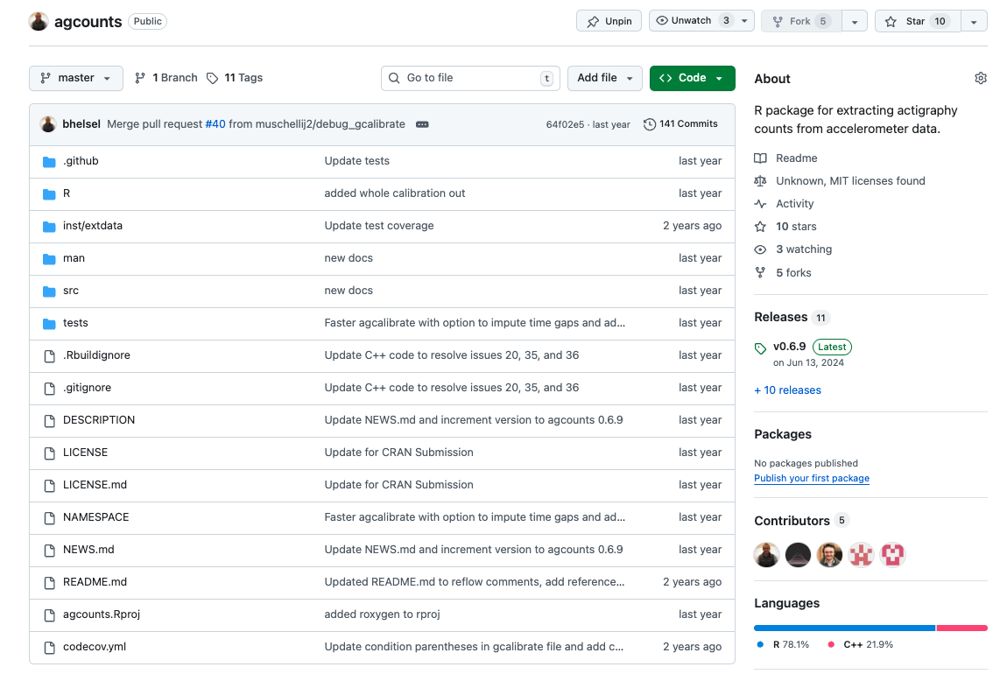</img>
</div>

:::
:::

## GitHub and CRAN

| Source  | Description | When to Use | Install With |
|---------|-------------|-------------|--------------|
| **CRAN** | Official R package repository | Most stable and tested version | `install.packages("pkgname")` |
| **GitHub** | Developer’s source code (often in progress) | Get latest features or unreleased updates | `devtools::install_github("user/pkgname")` |

**GitHub** is like a **developer’s lab** — early access, but maybe still being tested.

## Forking vs Cloning in Github

You usually **fork first**, then **clone your fork** to your computer. Once you clone the fork to
your computer, you can push code to your fork and then **submit a pull request** to merge code into
the main codebase.

|                | **Forking**                             | **Cloning**                          |
|:--------------:|:---------------------------------------:|:------------------------------------:|
| **What it is** | Copies a repo to *your* GitHub account  | Copies a repo to your *local* machine |
| **Where**      | Happens on **GitHub.com**               | Happens on **your computer**         |
| **Use case**   | You want to contribute or customize     | You want to use or explore code      |
| **Editable?**  | Yes — you own the forked version        | Yes — but you can’t push to original* |
| **Common for** | Submitting a pull request               | Working privately or learning        |


## My First R Package: bhelselR {.no-bg}

<div class="repos">
  <a href="https://github.com/bhelsel/bhelselR" target="_blank">
    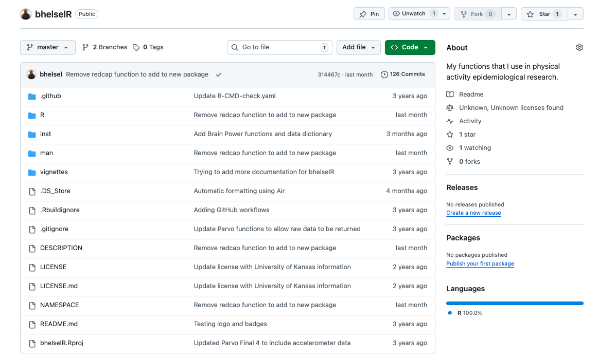</img>
  </a>
</div>

::: notes

This package started with some basic accelerometer functions that were eventually moved to
their own package. Now, it contains miscellaneous functions for sending emails on the KUMC server, 
parsing the HTML version of my FACT CV to extract presentations and articles by year, custom
vizualizations for checking normality or visualizing associations via a correlation matrix,
and sorting my downloads folder by file type.

:::

## Correlation Matrix {.no-bg-white}

```{r}
#| echo: true
#| eval: true
#| fig.width: 7
#| fig.height: 7
#| dpi: 300

cor <- bhelselR::cor_matrix(mtcars, vars = names(mtcars))

cor[[1]]

```


## abcds {.no-bg}

<div class="repos">
  <a href="https://github.com/bhelsel/abcds" target="_blank">
    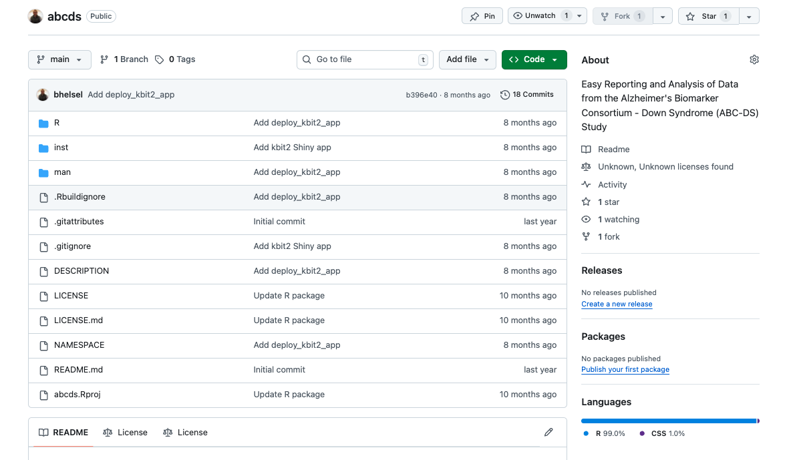</img>
  </a>
</div>


## agcounts {.no-bg}

<div class="repos">
  <a href="https://github.com/bhelsel/agcounts" target="_blank">
    </img>
  </a>
</div>

## agcounts get_counts

```{r}

file <- system.file("extdata/example.gt3x", package = "agcounts")

agcounts::get_counts(file, epoch = 60, verbose = TRUE)

#> [1] "------------------------- Reading ActiGraph GT3X File for example.gt3x -------------------------"
#> [1] "Reading and calibrating data with pygt3x."
#> [1] "Creating Downsampled Data"
#> [1] "Filtering Data"
#> [1] "Trimming Data"
#> [1] "Getting data back to 10Hz for accumulation"
#> [1] "Summing epochs"
#>                  time Axis1 Axis2 Axis3 Vector.Magnitude
#> 1 2023-06-13 08:34:00  2606  3114  3541             5388
#> 2 2023-06-13 08:35:00  1738  3942  2839             5159
#> 3 2023-06-13 08:36:00  2169  3364  2638             4794

```

## BRIDGE21 {.no-bg}

<div class="repos">
  <a href="https://github.com/bhelsel/BRIDGE21" target="_blank">
    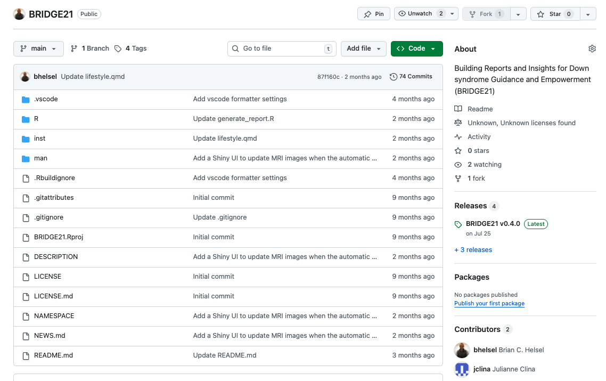</img>
  </a>
</div>

## BRIDGE21 Report {.no-bg-white}

<div style="height: 600px; overflow-y: auto;">

```{r}
#| echo: false
#| eval: true
#| results: asis

for (i in 1:16) {
  cat(
    paste0(
      '',
      '',
      ''
    ),
    sep = "\n"
  )
}

```

</div>

## Customized Figures for Blood Pressure {.no-bg-white}

```{r}
#| echo: true
#| eval: true
#| fig-height: 7

BRIDGE21::generate_bp_plot(136, 86)

```

## Custom Figures for BMI {.no-bg-white}

```{r}
#| echo: true
#| eval: true

BRIDGE21::generate_bmi_arch_plot(165, 70)

```

## iFitbit {.no-bg}

<div class="repos">
  <a href="https://github.com/bhelsel/iFitbit" target="_blank">
    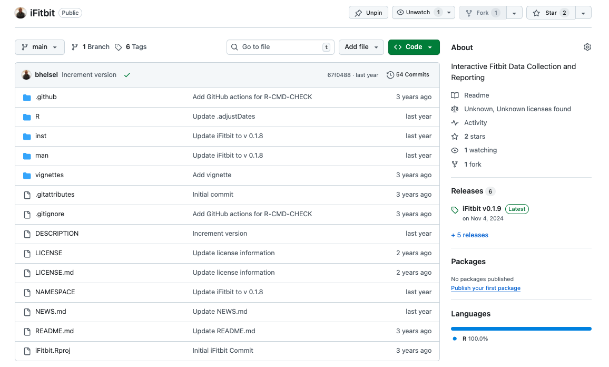</img>
  </a>
</div>

## iFitbit: Example Report {.no-bg-white}

<iframe src="html/FitbitExampleReport.html" width="100%" height="600px" data-external="1"></iframe>

## kuadrc.xnat {.no-bg}

<div class="repos">
  <a href="https://github.com/bhelsel/kuadrc.xnat" target="_blank">
    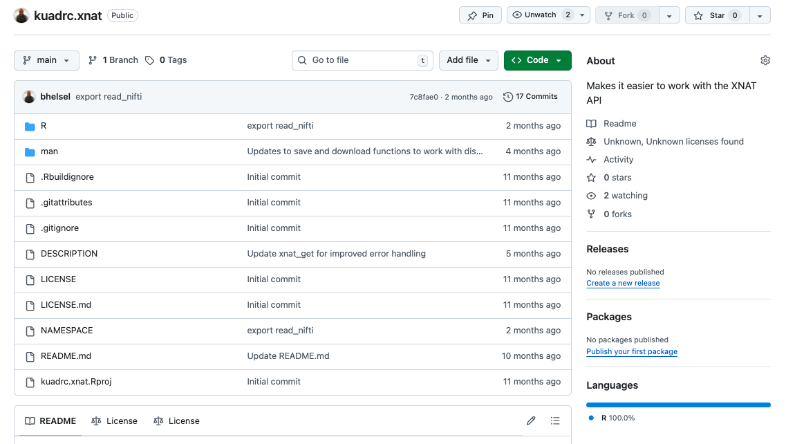</img>
  </a>
</div>

## kuadrc.xnat get_projects

```{r}

project_id <- kuadrc.xnat::get_projects("project_name")
subject_ids <- kuadrc.xnat::get_subjects(project = project_id)[["label"]]
experiment_id <- kuadrc.xnat::get_experiments(
  project = project_id,
  subject = subject_ids[1]
)

kuadrc.xnat::xnat_download(
  outdir = "path/to/location/data/should/be/stored",
  project = project_id,
  subject = subject_ids,
  experiment = experiment_id$ID,
  scans = "AX_T2_FLAIR"
)
#> Your downloaded data is stored in this folder:
#> /path/to/location/data/should/be/stored

kuadrc.xnat::convert_to_nifti("path/to/scans/folder")
#> Converting image from dicom to nifti: AX_T2_FLAIR (1/1 complete)

```

## Plot Nifti Data

::: {.columns}
::: {.column width="50%"}

```{r}

nifti_data <-
  kuadrc.xnat::read_nifti(
    "path/to/nii.gz/file"
  )

kuadrc.xnat::plot_nifti(
  nifti_data,
  plane = "axial",
  index = 5,
  adjust_brightness = 1.2
)

# This slice is 5 of 35.
# You can change the slice
# manually using the index
# argument within the plot_nifti
# function.

```

:::

::: {.column width="10%"}

:::

::: {.column width="40%"}

<div class="repos">
  </img>
</div>

:::
:::

## MoveKC {.no-bg}

<div class="repos">
  <a href="https://github.com/bhelsel/MoveKC" target="_blank">
    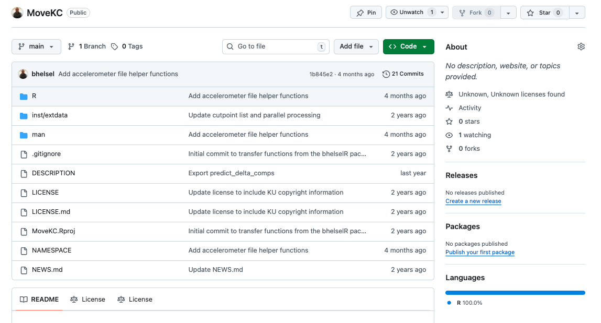</img>
  </a>
</div>

## parvoR {.no-bg}

<div class="repos">
  <a href="https://github.com/bhelsel/parvoR" target="_blank">
    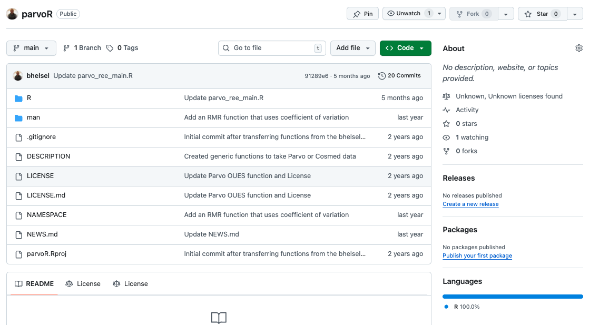</img>
  </a>
</div>

## quarto-kansas {.no-bg}

<div class="repos">
  <a href="https://github.com/bhelsel/quarto-kansas" target="_blank">
    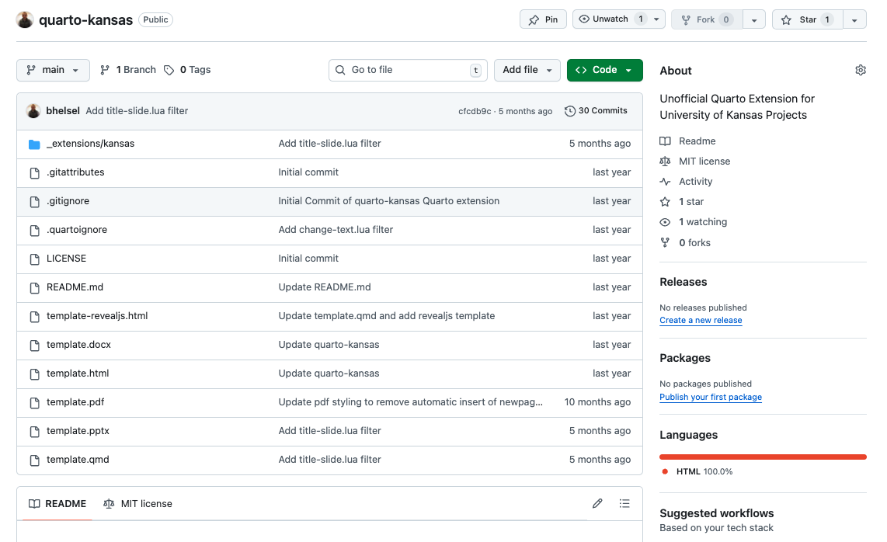</img>
  </a>
</div>

## Templates from the Quarto Extension {.no-bg}

:::::: {.columns}
::: {.column}

<div style="height: 600px; overflow-y: auto;">
  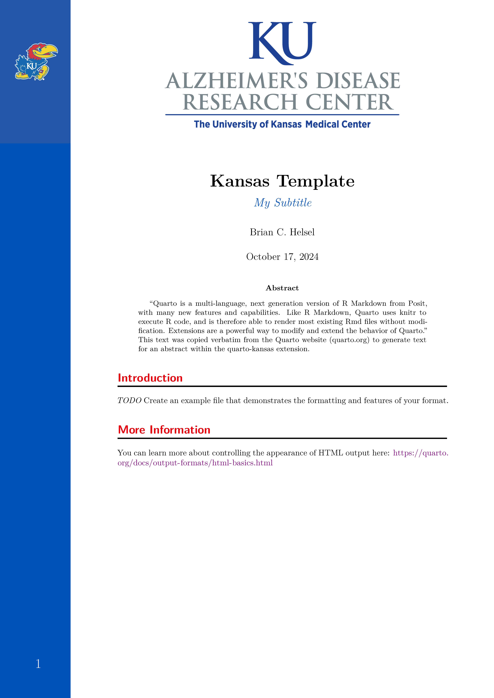
  
</div>

:::
::: {.column}

<iframe src="images/quarto/quarto-kansas-html-template.html" width="100%" height="600px"></iframe>

:::
:::

## REDirect {.no-bg}

<div class="repos">
  <a href="https://github.com/bhelsel/REDirect" target="_blank">
    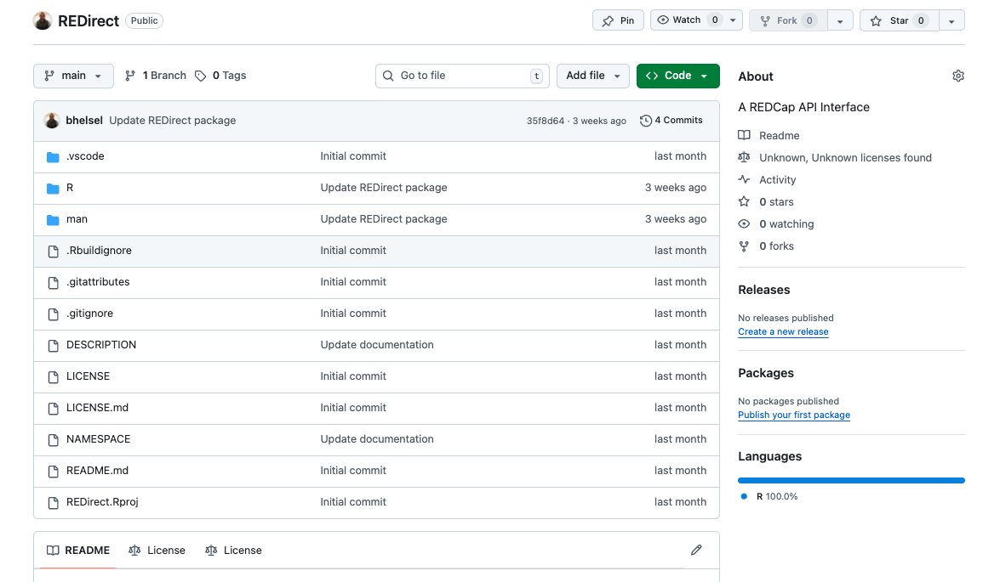</img>
  </a>
</div>

## RLAB {.no-bg}

<div class="repos">
  <a href="https://github.com/bhelsel/RLAB" target="_blank">
    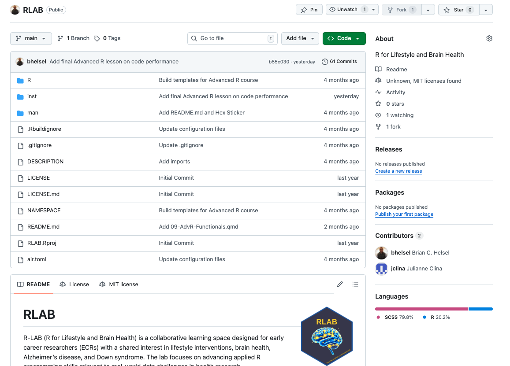</img>
  </a>
</div>

## tidyconsort {.no-bg}

<div class="repos">
  <a href="https://github.com/bhelsel/tidyconsort" target="_blank">
    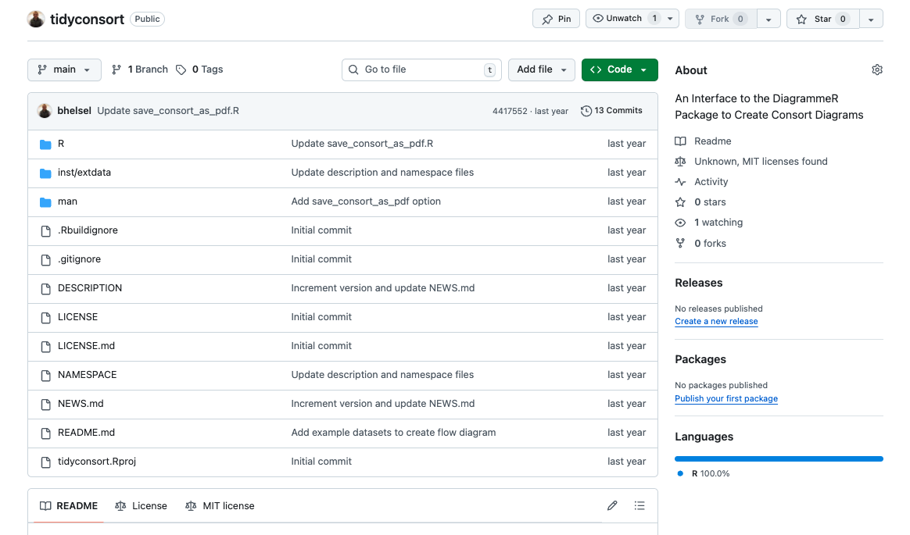</img>
  </a>
</div>

## Consort Diagram: Input

```{r}
#| echo: true
#| eval: true

library(tidyconsort)


nodes <- read.csv(system.file("extdata/nodes.csv", package = "tidyconsort"))
edges <- read.csv(system.file("extdata/edges.csv", package = "tidyconsort"))

positions <- unlist(lapply(1:nrow(nodes), function(x) {
  c(nodes$posX[x], nodes$posY[x])
}))

consort <-
  create_graph(width = 11, height = 10, ratio = "expand") |>
  set_node_parameters(shape = "box", style = "rounded,filled", width = 2) |>
  add_node(
    name = nodes$name,
    label = sprintf("%s \n (n = %s)", nodes$label, nodes$n),
    pos = positions,
    fillcolor = nodes$fillcolors,
    color = nodes$colors,
    width = nodes$width,
    height = nodes$height,
    fontsize = 18
  ) |>
  add_edge(from = edges$from, to = edges$to)

```

## Consort Diagram: Output

```{r}
#| echo: false
#| eval: true

consort

```

## Consort Diagram Template: Input


```{r}
#| echo: true
#| eval: true

consort2 <-
  tidyconsort::use_template_1(
    eligible = 82,
    randomized = 65,
    timepoints = 2,
    labels = c("Timepoint 1", "Timepoint 2"),
    descriptions = c("Baseline", "Follow-Up"),
    intervention = "Intervention",
    intervention_n = c(34, 32),
    control = "Control",
    control_n = c(31, 30)
  )

```

## Consort Diagram Template: Output

```{r}
#| echo: false
#| eval: true

consort2

```


